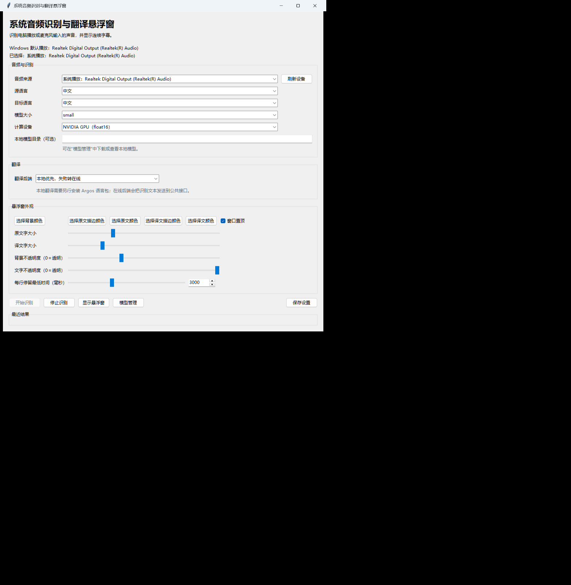

# Windows 系统音频识别与双语字幕悬浮窗 | Audio Subtitle Overlay

  

## 中文

AudioSubtitleOverlay 是 Windows 桌面悬浮字幕应用，可识别系统播放声音或麦克风输入，并同时显示源文本和译文。

- 支持系统播放回环和麦克风输入。
- 支持运行中切换音频来源、源语言、目标语言、识别模型和计算设备。
- 支持 CPU 运行；选择 GPU 时优先使用本机已有的兼容运行库，缺少时才按需准备。
- 主程序包约 108 MiB，低于 150 MiB；不要求目标电脑预装 Python。
- 提供独立的 tiny 模型包，便于离线携带默认模型。

### 下载与运行

1. 从 [GitHub Releases](https://github.com/Cormor/AudioSubtitleOverlay/releases) 下载主程序 ZIP。
2. 解压后保留完整的 `AudioSubtitleOverlay` 文件夹及其中的 `_internal` 文件夹。
3. 需要离线携带 tiny 模型时，再下载 tiny 模型 ZIP，并解压到与主程序相同的父目录。
4. 双击 `AudioSubtitleOverlay\AudioSubtitleOverlay.exe`。

主程序没有内置模型。联网时，应用会按需准备模型；使用 tiny 模型包可以在运行前准备默认模型。GPU 运行库仅在选择 GPU 且本机缺少对应组件时按需准备，CPU 模式不需要该运行库。

### 发布文件

- `AudioSubtitleOverlay_Portable_20260918.zip`：主程序，约 108 MiB。
- `AudioSubtitleOverlay_tiny_model_20260918.zip`：可选 tiny 模型包，约 67 MiB。
- `SHA256SUMS.txt`：发布文件校验值。

## English

AudioSubtitleOverlay is a Windows desktop subtitle overlay. It recognizes system playback or microphone audio locally and displays source text with translation.

- Supports system playback loopback and microphone input.
- Lets users change the audio source, languages, recognition model, and compute device while recognition is running.
- Supports CPU mode; GPU mode reuses a compatible runtime already available on the computer and prepares it only when missing.
- The main portable package is about 108 MiB and does not require Python to be installed on the target computer.
- An optional tiny-model package is provided for offline distribution.

### Download and run

1. Download the main ZIP from [GitHub Releases](https://github.com/Cormor/AudioSubtitleOverlay/releases).
2. Extract it and keep the complete `AudioSubtitleOverlay` directory, including `_internal`.
3. For offline use of the tiny model, extract the tiny-model ZIP under the same parent directory.
4. Double-click `AudioSubtitleOverlay\AudioSubtitleOverlay.exe`.

The main package does not include a speech model. When network access is available, the application prepares a missing model as needed; the tiny-model package can be prepared in advance. GPU runtime components are prepared only when GPU mode is selected and they are missing.

## 许可证与商业使用 | License and commercial use

项目自有代码采用 `AudioSubtitleOverlay Non-Commercial Source-Available License 1.0`，完整条款见 [`LICENSE`](LICENSE)。该许可证允许源代码可见，但不是 OSI 认可的 Open Source License。

- 个人、教育、研究、测试、爱好及其他非商业使用默认允许。
- 修改、集成、重新打包或再分发，必须公开完整对应源码和修改说明，或事先取得书面授权。
- 销售、收费分发、商业集成、企业内部业务使用、收入型服务及其他商业使用，必须事先取得商业授权。
- 第三方库、模型和运行库适用各自的许可条款，见 [`THIRD_PARTY_NOTICES.md`](THIRD_PARTY_NOTICES.md)。

The original code is provided under the `AudioSubtitleOverlay Non-Commercial Source-Available License 1.0`; see [`LICENSE`](LICENSE) for the complete terms. Non-commercial use is allowed by default. Modifications, integration, repackaging, and redistribution require public corresponding source with change notes or prior written authorization. All commercial use requires prior written authorization. Third-party components remain under their own terms.

商业授权说明见 [`COMMERCIAL-LICENSE.md`](COMMERCIAL-LICENSE.md)。
